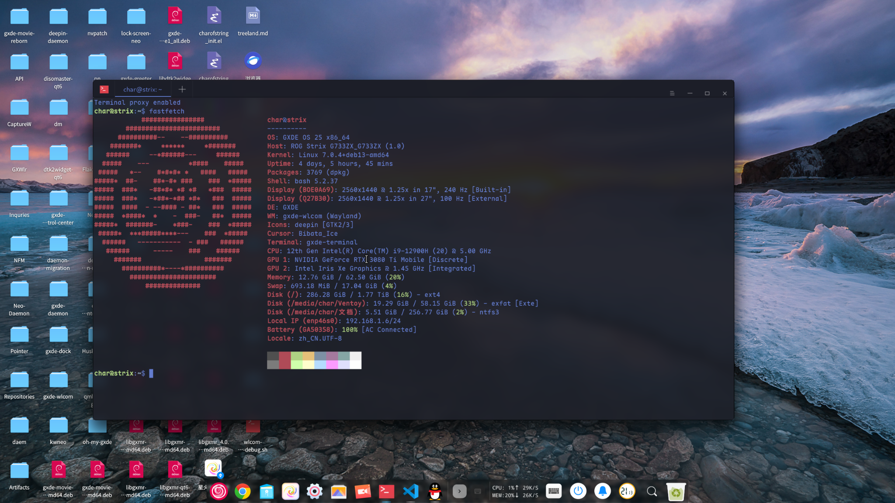

   

<div align="center">
  <!--
  <a href="https://github.com/othneildrew/Best-README-Template">
    
  </a>
  -->

  <h3 align="center">GXDE Wayland Compositor</h3>

  <p align="center">
    Yet another Wlroots based Wayland compositor that is forked from Kylin Wayland Window Compositor.
    <br />
    <a href="https://gitee.com/GXDE-OS/gxde-wlcom/tree/gxde/testing/docs"><strong>Explore docs »</strong></a>
    <br />
    <br />
    <a href="https://gitee.com/GXDE-OS/gxde-wlcom/tags">Previous Releases</a>
    &middot;
    <a href="https://gitee.com/GXDE-OS/gxde-wlcom/issues">Report an Issue</a>
    &middot;
    <a href="https://gitee.com/GXDE-OS/gxde-wlcom/issues">Request New Features</a>
  </p>

</div>

## About the Project



The GXDE Wayland Compositor (also known as `gxde-wlcom`) is a Wayland compositor built on `wlroots`, whose original code was forked from `kylin-wayland-compositor` (hereafter referred to as `kywc`).

This repository was forked by the GXDE OS team and adapted and optimized for GXDE OS on top of the original project. It is currently developed and maintained as the default compositor for GXDE OS Wayland sessions.

The project is released under the open-source license **GPL-3.0-or-later**. Files and code snippets from other open-source projects that are referenced or included in this project are used in accordance with their original license requirements.


### Advantages

1. ~~Few dependencies; no graphical frameworks such as Qt or GTK are introduced~~
2. Protocols between applications and the compositor are designed on demand. See "[PROTOCOLS](./docs/PROTOCOLS.md)" for the currently supported protocols.
3. Effects support, including common window animations.
4. Full Chinese input support, including `input-method v2` and `text-input v1/v2/v3`.
5. Keyboard shortcuts and touch gestures support, including keyboard shortcuts and touchpad/touchscreen gesture configuration.
6. Input device support, including mouse, keyboard, touchpad, touchscreen, and graphics tablet.
7. Internationalization (multi-language) support.
8. Multiple backends, including nested `x11/wayland` operation and `drm` and `fbdev` display backends.

### Changes Made by GXDE

1. Modified the build to resolve dependency issues.
2. Ported the default window appearance of the DDE Shell / deepin-chameleon "云璃" (Yunli) theme.
3. Ported the `dde-shell` protocol and extended the `wlr-layer-shell` arrangement logic to provide menu positioning support under Wayland for menu daemons such as `deepin-menu` that follow the X11 approach.
4. Cherry-picked some updates from upstream Wlroots.
5. Automatically installs the `gxde-wlcom` session and the `startgxde_wlcom` startup script to the system.
6. Fixed the issue where `layer-shell` surfaces in the original Wlcom (the version as of our fork) could not dock to the top of the screen on GXDE OS.
7. Provided a new interface to allow setting the GXDE theme.
8. Provided a new interface to control the visibility of the minimize/maximize/close buttons on the GTK title bar. (All visible by default)
9. Provided an interface that allows users to force-clip all CSD (client-side-decorated) windows so that they have rounded corners. Users can also allow the compositor to skip clipping the rounded corners of `layer-shell` surfaces (which usually include the GXDE top bar, Dock, GXDE Control Center, etc.). Force-clipping rounded corners is an unstable feature.
10. Added some aliases for existing Wlcom features for use by the GXDE Control Center (see [here](./docs/gxde/manual/dbus.md) for details).
11. Ported the Deepin-style multitasking view, referencing `deepin-kwin`.
12. Fixed the issue where `wl_seat` was broadcast later than clipboard-related global objects. KWayland-based clients such as `dde-clipboard-daemon` fetch the `seat` to create a data device as soon as the `data-control` manager is broadcast, which previously caused them to crash on startup.
13. Added clipboard persistence: after the source program exits, the compositor takes over its clipboard content so that programs such as screenshot tools that "copy and exit" can still be pasted normally (can be disabled with the build option `-Dclipboard_persist=false`).
14. Added full-screen screenshot to clipboard: press `PrintScreen` to capture the full screen; it can also be invoked through the `top.gxde.Wlcom.Screenshot` interface (see [here](./docs/gxde/manual/dbus.md) for details).


### Dependencies

Libraries or programs required at runtime:

- wayland, libinput, xkbcommon
- libseat, libdrm, libsystemd, librsvg-2.0
- cairo, pango, pangocairo, pixman-1, glib-2.0, gio-2.0
- gbm, json-c, libudev
- xwayland, xcb (optional)


Libraries or programs required at build time:

- ninja-build, libdrm-dev, libxkbcommon-dev, libpixman-1-dev, libgbm-dev, libudev-dev, libseat-dev, libinput-dev, libdisplay-info-dev, hwdata, libegl-dev, libgles2-mesa-dev, libxcb1-dev, libxcb-composite0-dev, libxcb-icccm4-dev, libxcb-render0-dev, libxcb-res0-dev, libxcb-ewmh-dev, libxcb-errors-dev, xwayland


### The Wlroots Issue

There is no need to worry about Wlroots: `meson` will automatically fetch Open Kylin's patched Wlroots from https://github.com/GXDE-OS/open-kylin-wlroots.git (our fork of the Open Kylin version of Wlroots), pin a suitable version, build it as a subproject, and link it statically.


Why build it as a subproject? Open Kylin has made extensive extensions and modifications to Wlroots, and the binary/dev package name is still `wlroots`:

| Item            | GXDE's bundled Wlroots (25.4) | Open Kylin version (0.7.14-ok17) | Conflict?                                             |
| --------------- | ----------------------------- | -------------------------------- | ----------------------------------------------------- |
| `.so` binary    | `libwlroots-0.19.so`          | `libwlroots-0.17.so`             | Fortunately no conflict, but it will conflict the day these two versions catch up to each other |
| Header files    | `/usr/include/wlr`            | `/usr/include/wlr`               | Yes, installing the `dev` package will overwrite them |

We did this to avoid conflicts with existing packages on the system.


### treeland-protocols 0.5.9 and the personalization protocol

> **In theory you no longer need to worry about this; GXWM already implements adaptive support for both versions**

**This section concerns whether the entire desktop can start. Be sure to read it before modifying `protocols/treeland-personalization-manager-v1.xml`.**

Upstream removed the `get_wallpaper_context` request and the `treeland_personalization_wallpaper_context_v1` interface in `treeland-protocols` 0.5.9 (commit `8576b9c`, 2026-06-16), on the grounds that the feature has been migrated to `xdg-desktop-portal`. The problem is that **this removal did not bump the version number** — the manager interface is `version="2"` both before and after, the interface name is unchanged, and the commit message itself says `Influence: Broken change`.

Wayland opcodes are ordered by their order of appearance in the XML; remove one request and everything after it shifts by one slot:

| Client sends                       | opcode | A server with a mismatched layout executes |
| ---------------------------------- | ------ | ------------------------------------------- |
| 0.5.9 client's `get_cursor_context` | 1      | 0.5.8 server's `get_wallpaper_context`      |
| 0.5.8 client's `get_appearance_context` | 4  | 0.5.9 server's `destroy`                    |

Since the two layouts have the same name and the same version, the server has no signal at `bind` time to distinguish which one the other side is, so **they cannot be compatible simultaneously**. Once they mismatch, all DTK programs (`libdtkgui`/`libdtk6gui`, i.e. nearly all GXDE programs) are killed by the compositor with a `wl_display error` at startup, and the desktop simply won't come up.

Therefore, the XML vendored in this repository must stay wire-compatible with **the one used when the DTK on the system was compiled**, rather than following upstream master. The version currently in the repository corresponds to **0.5.8 (including wallpaper context)**.

#### When you need to switch

The real trigger is not `apt upgrade treeland-protocols` — XML is only a compile-time input; upgrading the protocol package itself does not change any already-compiled clients. **The trigger is the moment `libdtkgui`/`libdtk6gui` etc. are recompiled against 0.5.9.**

However, the automatic detection below has taken this over, so under normal circumstances **no code changes, no recompilation, and no manual switching are needed** — you just need to **log in again**: the layout is fixed at `wl_global_create` time, and a running compositor will not re-detect midway, so newly started DTK programs in the current session will still hang after a DTK upgrade. After logging out and back in, automatic detection will see the new DTK and switch to 0.5.9.

Only two situations still require manual intervention:

- **DTK5 and DTK6 are out of sync** (only one of them was recompiled) — see below; you need to finish the compilation or manually specify which one to prioritize.
- **Someone synced `protocols/` to upstream** — this is the only operation that disables the switch. Fortunately it fails at compile time (the generated symbols referenced by the wallpaper implementation disappear, producing a string of errors such as `incomplete type`), so no binary is produced and it does not pose a hidden danger.

Criteria for judgment (choose either):

```bash
# 1. Check the system protocol package version
dpkg -l treeland-protocols

# 2. Directly check whether DTK still references the wallpaper context — this is the decisive one
#    (and the criterion the compositor's automatic detection uses)
strings -a /usr/lib/x86_64-linux-gnu/libdtk6gui.so.* | grep -c treeland_personalization_wallpaper_context
#   >0 : DTK is still compiled against 0.5.8; the 0.5.8 layout is needed
#    0 : DTK is already compiled against 0.5.9; the 0.5.9 layout is needed
```

#### Runtime switch (no recompilation needed)

The compositor compiles both layouts into the same binary and selects one at startup: the 0.5.8 layout uses the method table generated by wayland-scanner, while the 0.5.9 layout is assembled at runtime by picking `{0,2,3,4,5}` from the same table (skipping `get_wallpaper_context`), so both paths share the same source and will not drift independently. **The prerequisite is that the vendored XML remains a 0.5.8 superset** — once you truly switch to 0.5.9, this switch can be removed together with the wallpaper implementation.

This prerequisite has a code guard: at startup it checks whether the first request in the vendored XML is `get_wallpaper_context`; if not, it logs an `ERROR` indicating the switch has become invalid and serves the vendored table as-is. It targets changes like "the request still exists but its position changed", which compile but silently shift all opcodes; the case where the entire request is deleted won't even compile, so it never reaches this guard.

The default behavior is **automatic detection**: at startup it scans the installed `libdtk*gui` (checking both Qt5 and Qt6, including multiarch paths) to see whether they still reference `treeland_personalization_wallpaper_context_v1`. This is more accurate than checking the protocol package version, because XML is only a compile-time input. When no DTK can be detected (build chroot, minimal install), it falls back to checking `/usr/share/treeland-protocols`, and if that also fails, it defaults to 0.5.8.

In theory no forced setting is needed, but if you really must, just set an environment variable — change one line in `startgxde_wlcom` and log in again:

```bash
export GXDE_WLCOM_PERSONALIZATION=058   # or 059; also accepts 0.5.8 / 0.5.9
```

To confirm which one was selected (this line is `INFO` level, hidden by the default `WARN`, so `-V` or `KYWC_LOG_LEVEL=INFO` is needed):

```bash
# Logs go to stdout by default; to write to disk, pass -Dlogtofile to wlcom and then grep:
grep Personalization ~/.log/gxde-wlcom.log | tail -1
# (Treeland Shim) Personalization: probed 4 DTK libraries, wallpaper context referenced -> using the 0.5.8 layout
# (Treeland Shim) Personalization: layout forced to 0.5.9 by GXDE_WLCOM_PERSONALIZATION
```

If detection finds that DTK5 and DTK6 are **inconsistent** (one has been recompiled against 0.5.9 and the other hasn't), it logs an `ERROR` and selects 0.5.8. In such a mixed state, no single choice can keep both alive; you can only finish compiling the lagging package, or use the environment variable to specify which one to prioritize.

#### Master switch: don't broadcast the protocol at all

The switch above is a choice between two layouts, whereas this one simply does not broadcast the `treeland_personalization_manager_v1` global at all:

```bash
export GXWM_DONOT_BROADCAST_TLPM=TRUE   # also accepts ON / YES / 1, case-insensitive
```

**Disabled by default** (i.e. broadcast normally by default). Any value not in the list above is treated as disabled, including the case where the variable is exported but empty, so `=FALSE`, `=0`, or `export GXWM_DONOT_BROADCAST_TLPM=` all broadcast as usual and won't cause harm.

If upstream someday makes another breaking change without bumping the version, and even the layout switch above can't save the day, this lets the desktop at least log in. Clients that can't get this global fall back to their own default appearance — window blur, custom rounded corners, and client-specified title bars will stop working, but that's better than logging into a desktop whose panel doesn't show.

The log for this switch is `WARN` level (visible by default, no `-V` needed)

```bash
# Logs go to stdout by default; to write to disk, pass -Dlogtofile to wlcom and then grep:
grep Personalization ~/.log/gxde-wlcom.log | tail -1
# [WARN]: (Treeland Shim) Personalization: global not advertised, disabled by GXWM_DONOT_BROADCAST_TLPM
```

#### Completely removing the compatibility code

The switches above are enough for day-to-day switching; this section is for cleaning up dead code **after GXDE has fully moved to 0.5.9** (after which the compositor can no longer serve 0.5.8 clients).

Personally I don't think removal is necessary; using the switch throughout is enough.

Revert these two commits in order; no other changes are needed:

```bash
git revert 773f0364   # feat: Treeland personal manager version autoswitch
git revert 17585154   # fix: DTK program crashes due to lacking wallpaper support ...
ninja -C build
```

**The order must not be reversed.** The runtime switch in `773f0364` references symbols such as `get_wallpaper_context`/`manager_get_wallpaper_context`; reverting `17585154` first would leave a pile of dangling references.

This process has been verified: the two-step revert has no conflicts, compilation passes, and after reverting, `protocols/treeland-personalization-manager-v1.xml` returns to `1010e86f` (byte-for-byte identical to upstream master), fully wire-compatible with the 0.5.9 package (54 items). Note that `773f0364` also contains this section's README content; reverting it will delete these notes too — if you still need to keep them for the record later, remember to salvage the parts that still apply.

If a future rebase/squash invalidates the hashes, the equivalent manual steps are:

1. Overwrite the vendored XML with the new version from the system:
   ```bash
   cp /usr/share/treeland-protocols/treeland-personalization-manager-v1.xml protocols/
   ```
2. Delete the runtime switch in `src/view/treeland_personalization.c`: `enum personalization_layout`, the manager's `layout`/`interface_059`/`requests_059`, `manager_implementation_059` and `manager_impl_059`, `layout_derive_059`, `file_contains`, `dtk_lib_patterns`, `layout_from_env`, `layout_detect`, `layout_is_059`, and the detection section in `treeland_personalization_manager_create`; change `personalization_manager_bind` and `wl_global_create` back to directly using the generated `treeland_personalization_manager_v1_interface` and `manager_impl`.
3. Delete the wallpaper context implementation in the same file: the `wallpaper_*` function family, `wallpaper_impl`, `manager_get_wallpaper_context`, the `.get_wallpaper_context` in `manager_impl`, the `wallpaper` sub-structure in `personalization_context`, and the `wallpaper_contexts` and `wallpaper_metadata` in the manager along with their initialization/release. There are also two places related to `BLEND_MODE_WALLPAPER` in the file; they belong to the window context's blend mode and are unrelated to this section — **do not delete them**.
4. `ninja -C build`; if anything is missed, the compilation will report an error directly.

**Do not `git revert b9dafa79`.** That commit introduced the *entire* personalization support (the four context categories: window/cursor/font/appearance); reverting it would also discard window rounded corners, blur, and title bar control. After reverting, the compositor no longer broadcasts that global, and clients fall back on their own without crashing, but all features disappear — throwing the baby out with the bathwater.

As a side note, the XML vendored by b9dafa79 was itself **already** the 0.5.9 layout (byte-for-byte identical to upstream master); it was only because the DTK on the system was still compiled against 0.5.8 at the time that the mismatch occurred. So reverting `17585154` actually restores that file to its state at b9dafa79.

#### Required validation after modifying the XML

You can change the description text freely, but the wire layout (interfaces, request/event order, argument types, `type="destructor"`, `since`, version) must be exactly identical to the target version. After making changes, compare:

```bash
python3 - <<'EOF' protocols/treeland-personalization-manager-v1.xml /usr/share/treeland-protocols/treeland-personalization-manager-v1.xml
import sys, xml.etree.ElementTree as ET
def wire(p):
    out = []
    for i in ET.parse(p).getroot().findall('interface'):
        out.append(('IFACE', i.get('name'), i.get('version')))
        for kind in ('request', 'event'):
            for op, m in enumerate(i.findall(kind)):
                args = [(a.get('type'), a.get('interface')) for a in m.findall('arg')]
                out.append((kind, i.get('name'), op, m.get('name'), m.get('type'), m.get('since'), args))
    return out
a, b = wire(sys.argv[1]), wire(sys.argv[2])
print("WIRE IDENTICAL" if a == b else "WIRE MISMATCH:\n" + "\n".join(
    f"  ours={x}\n  upst={y}" for x, y in zip(a, b) if x != y))
EOF
```

Then run it once nested to confirm real-machine behavior; this step catches problems before polluting a real session:

```bash
WAYLAND_DISPLAY=wayland-0 ./build/gxde-wlcom   # exposes wayland-1 to the outside
WAYLAND_DISPLAY=wayland-1 gxde-terminal        # any DTK program; if it starts, it's normal
```

The same comparison is recommended for the remaining treeland protocols under `protocols/` — they currently match the system packages.


## Getting Started

### Building

#### (For EMACS Flymake/clang users) Initialize Flymake/clang

```bash
$ meson setup build
$ ln -sf build/compile_commands.json compile_commands.json
```

Then reopen `emacs`.

#### Manual build (command line)

Build options are in `meson_options.txt`; the simple build commands are as follows:

```bash
$ meson setup build -Dbuildtype=debugoptimized
$ ninja -C build
$ meson install -C build --skip-subprojects
```


#### Manual build (build script)

The build script is located at [./build-deb](./build-deb). It is a shell script used to generate install packages during debugging, making it easy to deploy and uninstall on a debugging machine.


First, modify the script permissions:

```bash
$ chmod a+x ./build-deb
```


Then the parameter help is as follows:

```bash
Usage: ./build-deb <options>

Options:
  -b, --binary          Build only the binary package (default behavior)
    -d, --install-deps    Install build dependencies first (reads debian/control), then build
    -c, --clean           Only clean build artifacts and exit
    -h, --help            Print help information
```


For the first build, it is recommended to run:

```bash
$ ./build-deb -d    # Install dependencies and build
```


After that, you no longer need to install dependencies:

```bash
$ ./build-deb    # Build directly
```


After building, clean up the intermediate artifacts:

```bash
$ ./build-deb -c
```


### Usage

> **Note**: By default, logs are output directly to stdout and the `$HOME/.log/gxde-wlcom.log` file is no longer generated; to write to disk for debugging, pass `-Dlogtofile` (writes to `$HOME/.log/gxde-wlcom.log`).


#### Basic usage

The program arguments are as follows:

```bash
Usage: kylin-wlcom [options] [command]
  -h, --help               Show help message and quit.\n
  -d, --debug              Enables full logging, including debug information.\n
  -D, --debug <options>    noxwayland, logtostdout, logtofile or loginmtime.\n
  -s, --session <process>  Run session on startup\n
  -v, --version            Show the version number and quit.\n
  -V, --verbose            Enables more verbose logging.\n
```


The `-D` argument allows convenient runtime debugging. The supported options are as follows:

```bash
-Dnoxwayland    Disable xwayland support
-Dlogtostdout   Print logs to stdout (default behavior, kept for compatibility)
-Dlogtofile     Write logs to $HOME/.log/gxde-wlcom.log
-Dloginmtime    Output logs using monotonic time
```


#### Setting up a kywc session on GXDE

~~See "[./docs/gxde/gxde-wlcom-session.md](./docs/gxde/depreciated/gxde-wlcom-session.md)" to learn how to set up a kywc session on GXDE.~~

GXDE Wlcom now automatically installs the session file when installing the `.deb` package, so manual installation is no longer needed. The related `.desktop` file and startup script can be found under `data/` in this repo.


#### GXDE-specific features

##### Multitasking view

Press `Meta+S` to open or close the multitasking view. The current implementation provides:

- Desktop and workspace wallpaper previews based on the `picture-uri` setting of `com.deepin.wrap.gnome.desktop.background`;
- Workspace previews with anti-aliased rounded corners and a 3px active highlight line;
- Live thumbnails of normal and minimized windows;
- Closing windows and toggling the always-on-top state of windows;
- Adding, removing, and switching workspaces;
- Dragging windows into other workspaces, keeping the multitasking view open after release;
- Dragging workspace previews to reorder workspaces.

The original implementation and resources from Deepin KWin are kept in
`src/vendor/dkwin/multitask/upstream/`, and the Wlcom adaptation layer is at
`src/vendor/dkwin/multitask/wlcom_multitask.c`.

The "Multitasking View" launcher in the GXDE menu can also be used directly without modifying any desktop file.
`gxde-wlcom` provides `com.deepin.wm` on the user session bus and connects
`PerformAction(1)` on `/com/deepin/wm` directly to the same native multitasking
view toggle. See
[multitasking-launcher-interface.md](./docs/gxde/manual/multitasking-launcher-interface.md)
for the interface contract and verification method.

##### Show desktop
In a Wayland session, `gxde-wlcom` directly holds `com.deepin.wm` and is compatible
with `GetIsShowDesktop()` and `SetShowDesktop(bool)`. The interface shares the
`view_manager_show_desktop()` state machine with `Meta+D`, so it only restores
windows minimized by this "show desktop" operation. X11 sessions are still
handled by the original `deepin-wm`; this package does not install or replace
`deepin-daemon`'s `desktop-toggle`.

##### Window switching
You can bring up the window switcher via `Alt + Tab` or `Alt + Shift + Tab`; its appearance mimics `Deepin KWin`.

##### Setting the GTK theme

On the user session bus, we provide the `top.gxde.Wlcom.Theme` interface, whose `SetGTK` method can be used to set an installed theme.

GNOME and UKUI theme settings are changed in sync, and the change should be visible immediately.

The following is a usage example; you need to replace `Theme Name` with a theme that actually exists on the machine.

```bash
busctl --user call \
  top.gxde.Wlcom.Theme \
  /top/gxde/Wlcom/Theme \
  top.gxde.Wlcom.Theme \
  SetGTK s "Theme Name"
```

This method takes a string argument and returns a boolean. Returning `true` means all applicable settings were written successfully.

##### Setting the visibility of GTK window buttons

The `top.gxde.Wlcom.WindowBtn` interface is used to set whether the minimize, maximize, and close buttons of GTK windows are shown. It uses three boolean arguments corresponding to whether these three buttons are shown.

The following are examples --

Set minimize/maximize/close buttons to all be shown:

```bash
busctl --user call \
  top.gxde.Wlcom.WindowBtn \
  /top/gxde/Wlcom/WindowBtn \
  top.gxde.Wlcom.WindowBtn \
  SetGtkDecorationButtons bbb true true true
```

Query the current settings:

```bash
busctl --user call \
  top.gxde.Wlcom.WindowBtn \
  /top/gxde/Wlcom/WindowBtn \
  top.gxde.Wlcom.WindowBtn \
  GetGtkDecorationButtons
```

##### Force-clipping rounded corners (unstable)

> Force-clipped rounded corners are different from the window rounded corners supported by Wlcom. With force-clipped rounded corners, all CSD (client-side-decorated) windows are forcibly clipped to rounded corners, and the corner radius depends on the window corner radius set by Wlcom (i.e. the value is shared with the ordinary "enable window rounded corners" feature)

On the user session bus, we provide the `top.gxde.Wlcom.WindowCorner` interface to manage two persistent DBus configurations:

- `ForceRoundCorner`: force-clip window rounded corners.
- `ForceRoundCornerExcludeLayerShell`: when force-clipping is enabled, do not clip
  `wlr-layer-shell` surfaces (e.g. windows of the top bar, Dock, GXDE Control Center, etc.). Only takes effect when `ForceRoundCorner` is enabled.

###### Enable force-clipping rounded corners

```bash
busctl --user call \
  top.gxde.Wlcom.WindowCorner \
  /top/gxde/Wlcom/WindowCorner \
  top.gxde.Wlcom.WindowCorner \
  SetForceRoundCorner b true
```

Change `true` to `false` in the command above to disable the corresponding setting. You can query the current value with the following method:

```bash
busctl --user call \
  top.gxde.Wlcom.WindowCorner \
  /top/gxde/Wlcom/WindowCorner \
  top.gxde.Wlcom.WindowCorner \
```

###### Enable force-clipping but exclude `wlr-layer-shell` surfaces:

```bash
busctl --user call \
  top.gxde.Wlcom.WindowCorner \
  /top/gxde/Wlcom/WindowCorner \
  top.gxde.Wlcom.WindowCorner \
  SetForceRoundCornerExcludeLayerShell b true
```

##### Notes

Configuration changes take effect immediately and are written to the `theme` object in `~/.config/gxde-wlcom/config.json`, with the corresponding keys being `force_round_corner` and `force_round_corner_exclude_layer_shell`.


## Internationalization

In the `po` directory, add the supported language to the `LINGUAS` file, and add the source files that need translating to `POTFILES.in`.

Then run the following command to update the `pot` file:

```bash
$ meson compile gxde-wlcom-pot
```


## Milestones

- [x] Added "Show Desktop" support

- [ ] Full compatibility with the Treeland protocol


## Contributing

See the "[CONTRIBUTING](./docs/CONTRIBUTING.md)" file for information needed to contribute.

For merge requests, please PR your code to the `gxde/testing` branch; after testing stabilizes, it will be merged into the `gxde/zhuangzhuang` branch by an administrator and bumped.

### Contributors of GXDE Wlcom

*(Note: for some unknown reason many contributors of the original KYWC are not shown; you can find information about the original KYWC contributors [here](https://gitee.com/openkylin/kylin-wayland-compositor/contributors?ref=debian%2Funstable))*

<a href="https://github.com/GXDE-OS/gxde-wlcom/graphs/contributors">
  
</a>


## License

This project is released under the open-source license `GPL-3.0-or-later`; see "[COPYING](./COPYING)".

Files or code snippets in this project that come from other open-source projects comply with their original open-source license requirements.

See the licenses under the `./LICENSES/` folder.

For each source file, also check the `SPDX-License-Identifier` indicated at its top.


# Acknowledgements

Thanks to the following code and templates for reference:

* **Treeland**: https://github.com/linuxdeepin/treeland
* **Treeland Protocols**: https://github.com/linuxdeepin/treeland-protocols
* **Open Kylin Wlcom**: https://gitee.com/openkylin/kylin-wayland-compositor
* **Open Kylin Wlroots**: https://gitee.com/openkylin/wlroots
* **Deepin KWin**: https://github.com/linuxdeepin/deepin-kwin
* **Wlroots**: https://gitlab.freedesktop.org/wlroots/wlroots
* **Sway**: https://github.com/swaywm
* **Wayfire**: https://github.com/wayfire
* **LabWC**: https://github.com/labwc
* **Best Readme Template**: https://github.com/othneildrew/Best-README-Template
