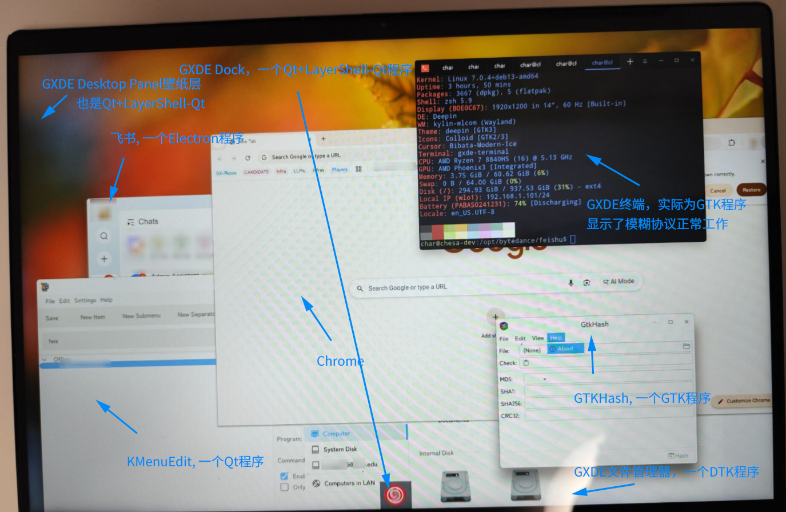
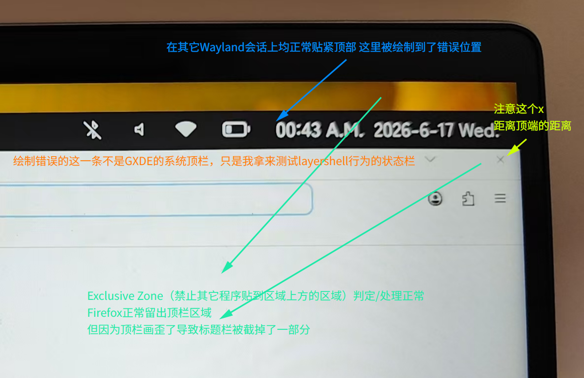
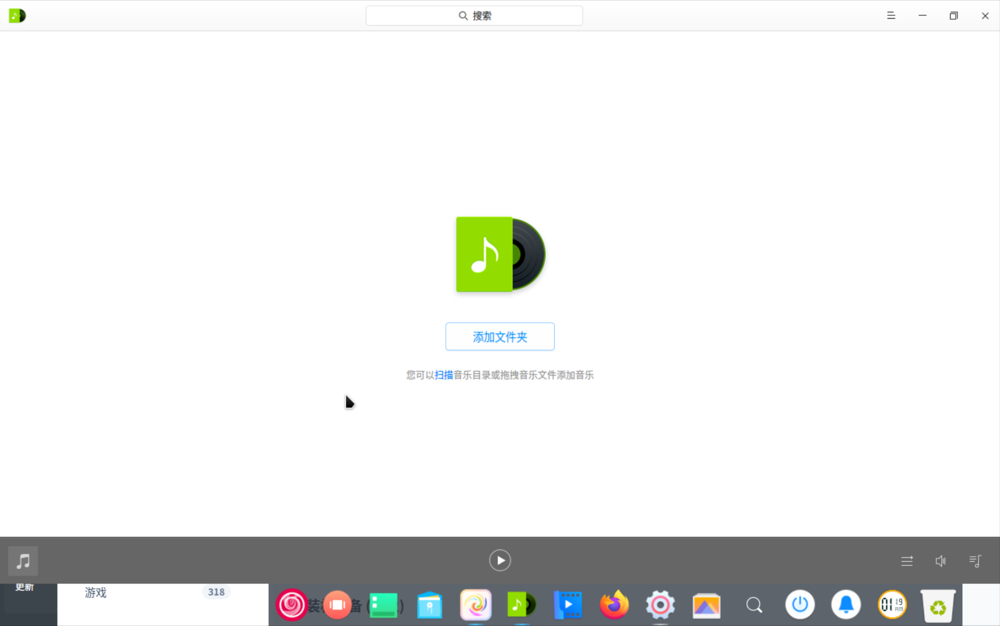

# 发布笔记：1.4.0-gxde1

## 更新日志

* 尝试修复实体机上的DMA-BUF渲染问题

  * 更新`wlroots`的依赖版本
  * 更新启动脚本
  * 包名变更为`gxde-wlcom`
  * 声明代替`kylin-wayland-compositor`, 且可以代替满足`kylin-wayland-compositor`


## 测试

### 实体机

在一台搭载AMD Phoneix3平台的笔记本上完成了实机测试：



实际配置:

```bash
char@wlplat:~$ fastfetch --logo none
char@wlplat
--------------
OS: GXDE OS 25 x86_64
Host: HP Envy x360 2-in-1 Laptop 14-fa0xxx
Kernel: Linux 7.0.4+deb13-amd64
Uptime: 9 hours, 3 mins
Packages: 3666 (dpkg), 5 (flatpak)
Shell: zsh 5.9
Display (BOE0C67): 1920x1200 in 14", 60 Hz [Built-in]
WM: kylin-wlcom (Wayland)
Theme: deepin [GTK3]
Icons: Colloid [GTK2/3]
Cursor: Bibata-Modern-Ice
Terminal: /dev/pts/0
CPU: AMD Ryzen 7 8840HS (16) @ 5.13 GHz
GPU: AMD Phoenix3 [Integrated]
Memory: 2.67 GiB / 60.62 GiB (4%)
Swap: 0 B / 64.00 GiB (0%)
Disk (/): 294.92 GiB / 937.53 GiB (31%) - ext4
Local IP (wlo1): 192.168.1.101/24
Battery (PABAS0241231): 31% [Discharging]
Locale: en_US.UTF-8
```


#### 有什么值得表扬的

*基本都在上图了，现在只是初步能用的版本*


#### 有什么需要批评的

* 加载Session所需要花费的事件太长了，绝对是什么东西卡了
* 图片里看的出来Dock会只有一个launcher的图标，实际上是这玩意加载慢在桌面出来后还要加载很久
* Chrome在我第一次关闭后再也没成功起来过，Firefox（提及它是因为它也有DMA-BUF渲染问题）多次打开/关闭没事，飞书（提及它是因为它是个Electron程序也用Chromium内核）也没事，更奇怪的是可以在终端用`google-chrome`手动拉起且渲染正常，可能多半不是WM的问题而得看看Dock什么的实现... 但我不确定。
* 我自己写的使用`layer-shell-qt6`的Wayland状态栏定位有问题，不知道是不是个例，如图：




### 虚拟机

使用一台具有3D加速的KVM虚拟机进行测试，操作日志请参阅「[1.4.0-gxde1虚拟机测试步骤记录](../attachments/1.4.0-gxde1虚拟机测试配置.md)」。




# 其它提出来的问题

1. LightDM登不进去这个会话，疑似是没有及时释放LightDM自己占用的VT导致的，为什么？跟我们有关系吗？这个WM可能针对这种情况优化吗？
2. Deepin Menu怎么加载的这么慢？Dock Shim有问题吗？